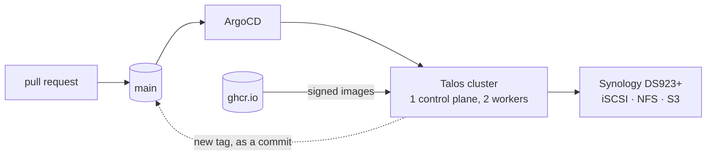

# homelab

> [!NOTE]
> The documentation in this repository was AI generated, but reviewed and corrected by a person.
> It *should* be free of hallucinations but something might have slipped through. Sorry!

A three-node Kubernetes cluster on [Talos Linux](https://www.talos.dev/), managed entirely
by GitOps. Every workload, every piece of platform configuration and every secret is in
this repository, and ArgoCD reconciles the rest.

It runs real things: a public website, a password vault, a media stack with GPU
transcoding, a recipe manager with its own PostgreSQL cluster. It is also where I try ideas
that are hard to justify trying at work for the first time.



## Stack

| | |
| --- | --- |
| **OS / cluster** | Talos Linux, Kubernetes, PXE-booted bare metal |
| **GitOps** | ArgoCD (app-of-apps, ApplicationSets, Image Updater), Helm, Kustomize |
| **Networking** | Cilium (kube-proxy replacement, L2 announcements, Hubble), Traefik, Cloudflare Tunnel, external-dns, cert-manager |
| **Storage** | Synology CSI (iSCSI + NFS), CSI snapshots, Velero, Garage S3 |
| **Security** | Kyverno, Falco, Pod Security Admission, CiliumNetworkPolicy, git-crypt, Docker Hardened Images |
| **Supply chain** | Trivy + Grype, cosign keyless signing, SLSA provenance, CycloneDX SBOMs |
| **Automation** | GitHub Actions (reusable workflows), Dependabot, pre-commit, Ansible |

## Things worth stealing

Documentation for each, with the reasoning:

- **[Images are verified by the cluster that runs them](docs/supply-chain.md).** Built to an
  OCI layout, scanned before push, signed at their digest, and checked at admission by a
  Kyverno policy that verifies those signatures. Plus a daily rescan
  that reports instead of gating, and two scanners because their databases disagree.
- **[One bootstrap Application creates the whole cluster](docs/gitops.md)** and passes its
  own git revision to every child, so pointing it at a branch moves the entire cluster to
  that branch.
- **[`talosctl bootstrap` alone gets ArgoCD running](docs/talos.md#bootstrapping-cilium-and-argocd).**
  Cilium and ArgoCD are rendered from the same Helm values that back their normal
  Applications and embedded in the machine config as a Talos inline manifest, so nothing is
  ever `helm install`ed or `kubectl apply`ed by hand to get from bare metal to GitOps.
- **[Image updates arrive as commits, not as cluster changes](docs/gitops.md#image-updates-that-leave-a-trail)**,
  with per-environment tag filters, because `newest-build` and no filter will happily deploy
  an open pull request's image.
- **[Split-horizon DNS from a single label](docs/networking.md#dns-one-cluster-two-providers).**
  `dns-type: internal` or `external` on an Ingress decides whether the record is created in
  PiHole or Cloudflare. Same manifest, two zones.
- **[Secrets committed to a public repository](docs/gitops.md#secrets-in-a-public-repository).**
  git-crypt selected by filename, and a patched ArgoCD that unlocks after every fetch, so
  decryption needs no operator. The key ships in the repository too, encrypted with itself.
- **[A password vault that repairs itself](docs/storage-and-backups.md#application-level-backup-vaultwarden).**
  Encrypted backups to the NAS and off-site, restored by an init container, and a pod that
  refuses to start empty instead of showing its clients an empty vault.
- **[The gaps, written down](docs/security.md#known-gaps).** Where the controls stop, and
  what it would take to close each one.

## Documentation

| Page | Contents |
| --- | --- |
| [Architecture](docs/architecture.md) | Hardware, Talos configuration, layering, component inventory |
| [GitOps](docs/gitops.md) | App-of-apps, sync waves, image updates, secrets in git |
| [Bootstrap chart](docs/bootstrap.md) | Getting ArgoCD running, and adding a template to app-of-apps |
| [Networking](docs/networking.md) | Cilium, ingress, split-horizon DNS, certificates, network policy |
| [Storage and backups](docs/storage-and-backups.md) | Storage classes, Velero, application-level backup, what is recoverable |
| [Supply chain](docs/supply-chain.md) | Build, scan, sign, attest, admit, rescan |
| [Security](docs/security.md) | Posture, layers, and known gaps |
| [Operations](docs/operations.md) | Bootstrap, adding an application, day-2 runbook |
| [Conventions](docs/conventions.md) | Layout, quality gates, review rules |
| [Talos](docs/talos.md) | Node config generation, version pinning, bootstrapping Cilium and ArgoCD |
| [Dev cluster](docs/dev-cluster.md) | The same cluster in Docker: what matches prod, what cannot, and how to reach it |
| [Synology](docs/synology.md) | What is configured on the NAS by hand |

## Repository layout

```text
kubernetes/charts/      app-of-apps chart (every application is registered here), plus Helm charts written here that are publishable on their own
kubernetes/helm/        values for upstream charts
kubernetes/kustomizations/  manifests for apps deployed without a chart
apps/                   Dockerfiles and the scripts they package
talos/                  node configuration: schematic, machine config patches, and the dev cluster script
ansible/                workstation setup, not cluster configuration
docs/                   the pages above
```

[sync-waves-inventory.md](sync-waves-inventory.md) is generated from the app-of-apps
templates on every push to `main`.

## Related repositories

| Repository | What it is |
| --- | --- |
| [github-workflows](https://github.com/theadzik/github-workflows) | The reusable build workflow every image here is built by: OCI layout, scan, sign, attest, tags last |
| [blog](https://github.com/theadzik/blog) | [zmuda.pro](https://zmuda.pro), deployed to this cluster from `ghcr.io` in two environments |
| [workout](https://github.com/theadzik/workout) | Unrelated to the cluster: a Python CLI that advances Garmin workout targets by double progression |

Several decisions here are written up at length on the blog: [PXE booting Talos from a
Synology NAS](https://zmuda.pro/talos-linux-using-pxe), [the NAS as Kubernetes
storage](https://zmuda.pro/synology-nas-setup), and [what this replaced](https://zmuda.pro/os-ansible-argocd-part-2).

## Licence

[Unlicense](LICENSE).
