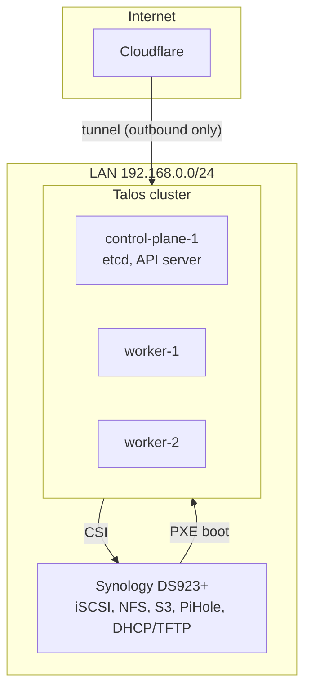

# Architecture

What the cluster is made of, and why each piece was chosen. Start here if you are
reading this repository to borrow an idea.

## The shape of it

Three bare-metal amd64 machines, 4 cores and 32 GiB each: one control plane and two
workers. A Synology DS923+ holds every byte of persistent state and, for good measure,
also serves DHCP, TFTP and DNS for the LAN it sits on.

There is no inbound port forward. The only path from the internet is a Cloudflare Tunnel
that the cluster dials outward, so the router exposes nothing at all.

## Why Talos

The nodes run [Talos Linux](https://www.talos.dev/): an immutable, API-driven distribution
with no shell, no SSH and no package manager. A node is configured by one machine config
file, and that file is generated from the inputs in [talos/](../talos/): a Factory schematic
naming the system extensions, a patch applied to every node, and an encrypted bundle holding
the cluster PKI. See [Talos](talos.md).

That trade was made knowingly. The previous generation of this homelab was Debian preseed
plus Ansible roles ([part 1](https://zmuda.pro/os-ansible-argocd-part-1),
[part 2](https://zmuda.pro/os-ansible-argocd-part-2)), which worked but meant owning an OS
build pipeline. Talos replaces it with a declarative config and a PXE boot, and the
migration is written up in
[PXE Booting Talos Linux from Synology NAS](https://zmuda.pro/talos-linux-using-pxe).

Four settings in that patch shape everything above them:

| Setting | Why |
| --- | --- |
| `cluster.network.cni.name: none` | Cilium provides the CNI, from a chart versioned in git like everything else. |
| `cluster.proxy.disabled: true` | Cilium replaces kube-proxy entirely. One less component, and eBPF service handling instead of iptables. |
| `rotate-server-certificates: true` | Kubelet serving certs get signed by the cluster CA, which is what lets metrics-server run without `insecureSkipTLSVerify`. |
| `cdi_spec_dirs` in containerd | Points CDI at writable paths so the Intel GPU driver can publish device specs at runtime. |

The system extensions matter just as much: `i915` for the Intel GPU that transcodes media,
`iscsi-tools` for Synology block storage, `nut-client` so the whole cluster powers down
cleanly when the UPS says the mains are gone.

## Layers

Everything above the OS is an ArgoCD `Application`, ordered by sync wave. The inventory in
[sync-waves-inventory.md](../sync-waves-inventory.md) is generated from the app-of-apps
templates, so it cannot drift from what is actually deployed.

| Wave | Layer | Components |
| --- | --- | --- |
| -99 | Self-management | ArgoCD manages its own chart and values |
| -80 | Networking | Cilium, which every later pod needs in order to be scheduled |
| -50 | Runtime detection | Falco, before anything it might need to watch |
| -40 | Scheduling primitives | PriorityClasses |
| -35 | Node-level plumbing | Synology CSI, Intel GPU resource driver |
| -25 | Trust and entry | cert-manager, Kyverno, Traefik, kubelet cert approver |
| -15 | Cluster services | external-dns, metrics-server |
| -5 | Data services | CloudNativePG operator |
| 0 | Workloads | Media stack, Vaultwarden, Tandoor, Audiobookshelf, blog |
| 1 | External exposure | Cloudflare Tunnel, once there is something to expose |
| 5 | Day-2 automation | Velero, VPA, ArgoCD Image Updater |
| 10 | Optimisation | Descheduler, last, so it rebalances a settled cluster |

The ordering encodes real dependencies, not preference. Traefik cannot get a certificate
before cert-manager exists. Nothing can be scheduled onto Synology volumes before the CSI
driver is up. And a descheduler evicting pods during the initial converge would be actively
harmful.

## Component inventory

| Component | Role | Delivered as |
| --- | --- | --- |
| [ArgoCD](https://argo-cd.readthedocs.io/) | GitOps engine, self-managed | Upstream chart + [custom image](../apps/custom-argocd/) with git-crypt |
| [Cilium](https://cilium.io/) | CNI, kube-proxy replacement, L2 announcements, network policy | Upstream chart + [CRDs](../kubernetes/kustomizations/cilium/) |
| [Traefik](https://traefik.io/) | Ingress controller | Upstream OCI chart |
| [cloudflared](https://developers.cloudflare.com/cloudflare-one/connections/connect-networks/) | Outbound tunnel, the only inbound path | [Kustomize](../kubernetes/kustomizations/cloudflared/) |
| [cert-manager](https://cert-manager.io/) | Let's Encrypt certificates via DNS-01 | Upstream chart + ClusterIssuers |
| [external-dns](https://kubernetes-sigs.github.io/external-dns/) | DNS records, two providers, one cluster | Upstream chart, twice |
| [Synology CSI](https://github.com/SynologyOpenSource/synology-csi) | iSCSI and NFS volumes, CSI snapshots | [Kustomize](../kubernetes/kustomizations/synology-csi/) |
| [Velero](https://velero.io/) | Cluster and volume backups to S3 | Upstream chart |
| [Kyverno](https://kyverno.io/) | Admission policy: signature and attestation verification | Upstream chart + [policy](../kubernetes/kustomizations/kyverno/) |
| [Falco](https://falco.org/) | Runtime threat detection with alert routing | Upstream chart |
| [CloudNativePG](https://cloudnative-pg.io/) | PostgreSQL operator | Upstream chart |
| [VPA](https://github.com/kubernetes/autoscaler/tree/master/vertical-pod-autoscaler) | Right-sizing requests, in place where possible | Upstream chart |
| [Descheduler](https://github.com/kubernetes-sigs/descheduler) | Periodic rebalancing | Upstream chart |
| [metrics-server](https://github.com/kubernetes-sigs/metrics-server) | Resource metrics API | Upstream chart |
| [Intel GPU resource driver](https://github.com/intel/intel-resource-drivers-for-kubernetes) | GPU via Dynamic Resource Allocation | Upstream OCI chart |
| [ArgoCD Image Updater](https://argocd-image-updater.readthedocs.io/) | Writes new image tags back to git | Upstream OCI chart |

## Workloads

| Workload | What it is | Notable |
| --- | --- | --- |
| [media-stack](../charts/media-stack/) | Jellyfin, Radarr, Sonarr, Bazarr, NZBGet | A [public Helm chart](../charts/) written here, GPU transcoding through DRA |
| [Vaultwarden](../apps/vaultwarden/) | Password manager | Encrypted backups, restore as an init container |
| [Tandoor](../kubernetes/kustomizations/tandoor/) | Recipe manager | PostgreSQL from the CloudNativePG operator |
| [Audiobookshelf](../kubernetes/kustomizations/audiobookshelf/) | Audiobook and podcast server | |
| [blog](../kubernetes/kustomizations/blog/) | [zmuda.pro](https://zmuda.pro), built from [theadzik/blog](https://github.com/theadzik/blog) | One ApplicationSet, two environments, two update strategies |

## Where the state lives

Nothing important lives on a node. A Talos machine is cattle. Reinstall it by PXE and it
rejoins.

- **Block and file storage**: the DS923+ over iSCSI and NFS, split into HDD and SSD tiers by
  a `location: /volume2` parameter on the storage class.
- **Object storage**: [Garage](https://garagehq.deuxfleurs.fr/) on the same NAS, which is
  where Velero puts cluster backups.
- **Secrets**: in this repository, encrypted with git-crypt, decrypted by ArgoCD at sync
  time.
- **Everything else**: this repository. If the cluster is lost, the recovery path is
  [bootstrap](operations.md#bootstrapping-from-nothing), not a restore.

[Storage and backups](storage-and-backups.md) covers the tiers, the snapshot schedule and
what is actually recoverable.

## Reading on

| Page | Contents |
| --- | --- |
| [GitOps](gitops.md) | App-of-apps, sync waves, image updates, secrets in git |
| [Networking](networking.md) | Cilium, ingress, split-horizon DNS, certificates |
| [Storage and backups](storage-and-backups.md) | Storage classes, Velero, application-level backup |
| [Supply chain](supply-chain.md) | How images are built, signed and admitted |
| [Security](security.md) | Runtime detection, hardening, secret handling |
| [Operations](operations.md) | Bootstrap, adding an app, day-2 tasks |
| [Talos](talos.md) | Generating the machine configs, version pins, the CNI gap |
| [Conventions](conventions.md) | Repository layout, quality gates, automation |
