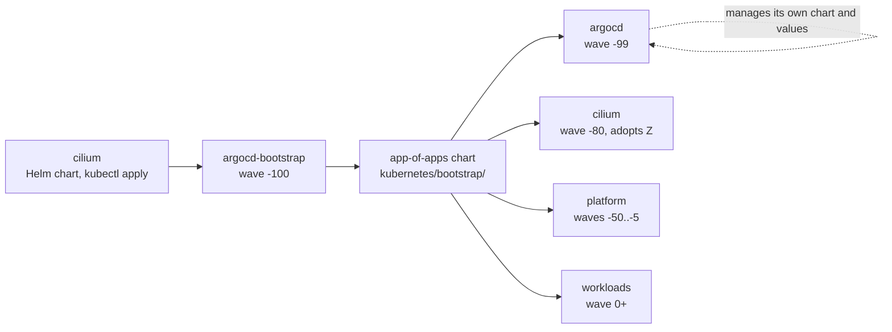
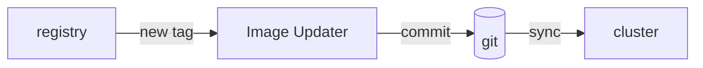

# GitOps

Every workload in the cluster is declared in this repository, and nothing reaches the
cluster any other way. This page covers how that is wired: what bootstraps what, how
upstream charts are combined with local values, how image updates get back into git, and
how secrets survive being committed to a public repository.

## One entry point, and one thing before it

Two things are applied by hand, and only once. Everything else descends from them.



Cilium goes first, before ArgoCD exists at all. A cluster with no CNI schedules no pods, so
nothing, including ArgoCD, can run until Cilium is on the nodes. It is installed with a plain
`helm template | kubectl apply`, and the `cilium` Application in the app-of-apps chart
adopts that release afterwards, at sync wave -80. See
[Operations](operations.md#2-install-cilium-by-hand-once) for the command.

Everything after that is one `Application`, applied by hand exactly once.
[`argocd-bootstrap.yaml`](../kubernetes/kustomizations/argocd/argocd-bootstrap.yaml) points
ArgoCD at [`kubernetes/bootstrap/charts/app-of-apps`](../kubernetes/bootstrap/charts/app-of-apps/),
a Helm chart whose templates are the `Application` and `ApplicationSet` definitions for
everything else. Adding an app to the cluster means adding one template there. There is no
second place to register it.

It passes its own revision down as a Helm parameter:

```yaml
helm:
  parameters:
    - name: "spec.sources.targetRevision"
      value: $ARGOCD_APP_SOURCE_TARGET_REVISION
```

Every child app inherits that value, so pointing the bootstrap Application at a branch
points the entire cluster at that branch. A whole-cluster change can be tried without
touching `main`.

ArgoCD then manages ArgoCD, at wave -99. Its chart version, its values and its custom image
are reconciled like any other app. An upgrade is a pull request, not a `helm upgrade` typed
at a terminal.

## Upstream charts, local values

Most apps use ArgoCD's multi-source form: the chart from its own upstream repository, the
values from this one.

```yaml
sources:
  - chart: metrics-server
    repoURL: https://kubernetes-sigs.github.io/metrics-server/
    targetRevision: 3.*.*
    helm:
      valueFiles:
        - $repo/kubernetes/helm/metrics-server/values.yaml
  - repoURL: "{{ .Values.spec.sources.repoURL }}"
    targetRevision: "{{ .Values.spec.sources.targetRevision }}"
    ref: repo
```

The second source exists only to be referenced. `ref: repo` names it, `$repo` resolves to
it in the first source's `valueFiles`, and no chart is ever vendored. Upstream stays
upstream, and the diff in this repository is only ever the configuration.

`targetRevision` is a constraint, not a pin: `v1.*.*`, `3.*`, `0.28.*`. Patch and minor
releases arrive on their own, majors never do. For a homelab that is the right trade. The
alternative is either a pull request per patch release for every chart in the cluster, or
infrastructure that silently rots. Workload images are handled the opposite way, pinned
exactly and moved by automation that leaves a commit behind.

Four delivery styles coexist, chosen per app:

| Style | Used when | Example |
| --- | --- | --- |
| Upstream chart + values file | The values are worth a file of their own | [metrics-server](../kubernetes/helm/metrics-server/values.yaml) |
| Upstream chart + inline `valuesObject` | A handful of resource requests, and nothing else | [cert-manager](../kubernetes/bootstrap/charts/app-of-apps/templates/cert-manager.yaml) |
| Kustomize | No chart, or the chart is more trouble than the manifests | [cloudflared](../kubernetes/kustomizations/cloudflared/) |
| Local chart in this repo | The thing is worth publishing on its own | [media-stack](../charts/media-stack/) |

## Sync waves

Ordering is expressed as `argocd.argoproj.io/sync-wave` on each Application, and the
resulting order is published in [sync-waves-inventory.md](../sync-waves-inventory.md).

That file is generated, not written. A [GitHub Actions
workflow](../.github/workflows/sync-waves-inventory.yaml) reads the app-of-apps templates
on every push to `main` and commits the result back, authenticating as a GitHub App so the
commit has a clear author and the push does not require a personal token. Editing it by hand
is a repository policy violation. The wave lives on the Application, and the document
follows.

Waves matter most on a cold start, when everything converges at once. See
[Architecture](architecture.md#layers) for what each band contains and why.

## Sync policy, and the parts that are deliberately not automatic

Applications share one shape:

```yaml
syncPolicy:
  automated:
    enabled: true
    prune: true
    selfHeal: true
  syncOptions:
    - PruneLast=true
  retry:
    limit: 10
    backoff: { duration: 10s, factor: 2, maxDuration: 3m }
```

`selfHeal` reverts a manual `kubectl edit`, so the cluster stays at what git says. `prune`
means deleting a manifest deletes the object, and `PruneLast` delays that until the
replacements are healthy.

Exceptions are per-resource and explicit:

- **Data that must outlive its manifest** carries
  `argocd.argoproj.io/sync-options: Delete=false,Prune=false`, such as the 7 TiB media PVC
  and its namespace. Removing the app must not be able to remove the library.
- **Fields owned by something else** are excluded with `ignoreDifferences`. metrics-server's
  APIService is annotated for cert-manager CA injection, and its `insecureSkipTLSVerify`
  does not survive the round trip through the API server. Without the exclusion the app
  never reaches Synced, and a permanently OutOfSync app is one nobody looks at.

## Two environments from one manifest

The blog runs as dev and prod from a single
[`ApplicationSet`](../kubernetes/bootstrap/charts/app-of-apps/templates/blog.yaml) over a
list generator, each element selecting a
[kustomize overlay](../kubernetes/kustomizations/blog/overlays/). The base holds the
deployment, service, ingress and network policy. The overlays change replica count, host
name, pull policy, and most importantly which image tag the environment tracks.

Because the generator's `{{env}}` and Helm's `{{ }}` share a delimiter, the template escapes
the ArgoCD placeholders so Helm emits them literally and ArgoCD expands them later. It is
the kind of thing that costs an afternoon once, so it is commented in place.

## Image updates that leave a trail

[ArgoCD Image Updater](https://argocd-image-updater.readthedocs.io/) watches registries and
writes new tags **back into this repository** instead of patching the cluster. Git stays the
source of truth, and every image bump is a commit with an author, a diff and a revert.



Write-back targets match how the app is deployed: `kustomization:` for kustomize apps,
`helmvalues:` for Helm ones, pointed at a specific values path such as
`services.jellyfin.tag`.

The tag filters are where the real policy sits:

| App | Strategy | Filter | Why |
| --- | --- | --- | --- |
| blog-dev | `newest-build` | `^sha-[0-9a-f]{7}$` | Per-commit builds of `main` only. Without the filter it also accepted `pr-<n>` tags, so dev ran unmerged code. |
| blog-prod | `semver` | `^\d{4}\.\d{1,2}\.\d{1,2}$` | CalVer releases only. |
| radarr, sonarr | `semver` | `^\d+\.\d+\.\d+$` | Upstream publishes non-release tags on the same repository. |
| jellyfin, bazarr, nzbget | `semver` on `~10`, `~1`, `~26` | | Major pinned at the image reference, minors flow. |

Skipping the regex is how dev ended up running pull request builds: `newest-build` takes
whatever was pushed most recently, and a registry holds a great deal more than releases.

## Secrets in a public repository

Every secret in this repository is committed, encrypted with
[git-crypt](https://github.com/AGWA/git-crypt). One line in
[`.gitattributes`](../.gitattributes) does the selection:

```text
*secret* filter=git-crypt diff=git-crypt
```

Filename is the contract. Anything with `secret` in its name is encrypted on commit and
opaque on GitHub. The naming rule is enforced in review, and the same pattern excludes those
files from [detect-secrets](../.pre-commit-config.yaml), because a git-crypt blob would
otherwise be flagged as high-entropy on every run.

ArgoCD has to be able to read them, which upstream ArgoCD cannot do. The
[custom image](../apps/custom-argocd/) adds the `git-crypt` binary and wraps `git`:

```sh
#!/bin/sh
$(dirname $0)/git.bin "$@"
ec=$?
[ "$1" = fetch ] || exit $ec
git-crypt unlock "$GITCRYPT_KEY_PATH" 2>/dev/null
exit $ec
```

Every `git fetch` the repo-server performs is followed by an unlock, so decryption happens
exactly where and when it is needed, with no operator in the loop.

The key reaches the repo-server as a Kubernetes Secret, and that Secret is
[in this repository](../kubernetes/kustomizations/argocd/argocd-gitcrypt-secret.yaml) like
everything else. Its filename matches `*secret*`, so git-crypt encrypts it with the very key
it contains. That is circular, and it does no harm. The file is only readable by something
that can already read the repository, so committing it gives an attacker nothing, and the
cluster's access ends up declared instead of injected by hand.

What breaks the circle is an out-of-band copy, and git-crypt supports two:

| Path | Used for |
| --- | --- |
| `git-crypt unlock <keyfile>` | An exported symmetric key, kept outside the repository and outside the cluster |
| `git-crypt unlock` with a registered GPG key | The collaborator key under [`.git-crypt/keys/`](../.git-crypt/), which holds the same symmetric key encrypted to a GPG public key |

Either one unlocks a fresh clone, and from there `kubectl apply -k` hands the cluster the
Secret it needs. Losing **both** is the unrecoverable case. See
[Storage and backups](storage-and-backups.md#what-is-actually-recoverable).

The image is built and published from this repository, tagged with the ArgoCD app version
resolved from the chart the cluster is running, so it can never drift from the version it
patches. See [Supply chain](supply-chain.md).

## What this buys

Anything running in the cluster is in a file here, so there is no undocumented state to
reconstruct from memory. Rollback is `git revert`, image versions included, because updates
arrive as commits. A branch can hold an entire cluster's worth of change through the
inherited `targetRevision`. And because nothing is applied by hand, nothing is lost when the
person who applied it forgets they did.

## See also

- [Bootstrap chart](bootstrap.md): the app-of-apps chart itself, and adding a template to it
- [Operations](operations.md): bootstrapping, adding an app, and what to do when a sync
  will not settle
- [Supply chain](supply-chain.md): where the images that Image Updater discovers come from
- [Conventions](conventions.md): the review and validation gates a change passes first
