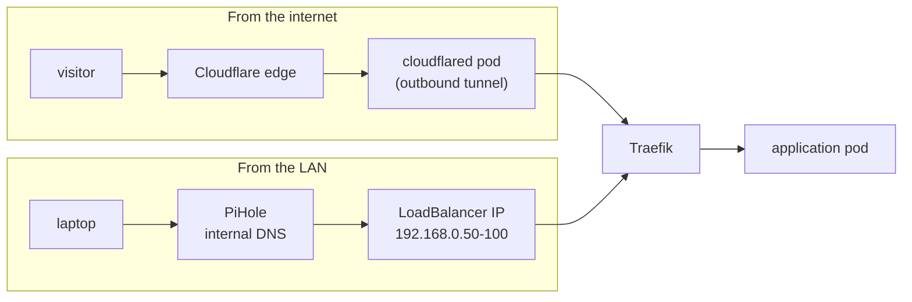

# Networking

Two ways in, one way out, and no port forward anywhere. This page traces both request
paths end to end and explains the pieces they pass through.

## The two paths



**Externally**, `zmuda.pro` resolves to a Cloudflare-proxied CNAME pointing at
`<tunnel-id>.cfargotunnel.com`. Cloudflare terminates the visitor's TLS and hands the
request to a `cloudflared` pod over a connection that pod opened outbound. Nothing listens
on the router, so there is no NAT rule to get wrong.

**Internally**, PiHole on the NAS resolves hostnames like `argocd.zmuda.pro` to an address
from the Cilium load-balancer pool, announced on the LAN by ARP. Those addresses are RFC 1918
and the tunnel only forwards to Traefik. There is no route from the internet to them at all,
so no rule has to deny one.

Both paths terminate at the same Traefik service, so an application is configured once and
its exposure is decided entirely by which DNS record points at it.

## Cilium

Cilium is the CNI, and it replaces kube-proxy outright. Talos ships with
`cluster.network.cni.name: none` and `cluster.proxy.disabled: true`, so there is no CNI or
proxy to remove first. The cluster has no networking at all until Cilium is installed.

That last part has a consequence at bootstrap. ArgoCD cannot be the thing that installs
Cilium, because ArgoCD is a pod and pods need a CNI. Talos creates it directly instead, and
the `cilium` Application adopts the release afterwards at sync wave -80, before any workload
or platform component that will depend on it. See
[Talos](talos.md#bootstrapping-cilium-and-argocd) for how.

```yaml
kubeProxyReplacement: true
k8sServiceHost: localhost
k8sServicePort: 7445
```

`localhost:7445` is [KubePrism](https://docs.siderolabs.com/talos/latest/kubernetes-guides/configuration/kubeprism),
Talos's node-local API server proxy. Pointing Cilium at it solves a chicken-and-egg problem.
The agent needs the API server, and reaching the API server through a Service needs the
agent. It also survives a control-plane restart without the agents noticing.

The `cgroup` and `securityContext.capabilities` blocks in
[values.yaml](../kubernetes/helm/cilium/values.yaml) exist because Talos mounts cgroups
itself and grants no capability the workload has not asked for. Both blocks are copied
straight from Cilium's Talos guidance.

`bpf.hostLegacyRouting: true` comes from the same guidance and fixes a specific collision.
Talos forwards kube-dns to the host resolver by default from 1.8 onwards, and that does not
work with Cilium's eBPF host-routing. Cilium's
[Talos prerequisites](https://docs.cilium.io/en/stable/installation/k8s-install-helm/) are
blunt about the consequence: set it, or DNS does not work. It routes host traffic through
the kernel's normal path instead of the eBPF shortcut, which costs some throughput.

### Load balancing without a load balancer

There is no cloud provider here, so `type: LoadBalancer` needs an answer. Cilium provides
one in two objects:

```yaml
# CiliumLoadBalancerIPPool
blocks:
  - start: "192.168.0.50"
    stop: "192.168.0.100"
```

```yaml
# CiliumL2AnnouncementPolicy
externalIPs: true
loadBalancerIPs: true
```

A Service gets an address from the pool, and a node answers ARP for it. Traefik names
`loadBalancerClass: io.cilium/l2-announcer` explicitly, so the Service says which
implementation it expects instead of taking whatever controller happens to be watching.

Failover is a lease. The values shorten it deliberately:

```yaml
l2announcements:
  leaseDuration: 3s
  leaseRenewDeadline: 1s
  leaseRetryPeriod: 200ms
```

The defaults are measured in tens of seconds, which is a long outage for a node reboot on a
three-node cluster where reboots are routine. The cost is more traffic to the API server,
which this cluster has room for.

### Observability

Hubble relay and UI are enabled and published at `hubble.zmuda.pro` (internal only). Seeing
the flows is what makes the network policies below maintainable. A denied flow shows up as a
drop with both identities named, instead of an application that hangs for reasons nobody can
reconstruct.

## Traefik

Traefik is the only ingress controller, deployed from the upstream OCI chart with
[local values](../kubernetes/helm/traefik/values.yaml).

Since everything else in the cluster is reachable only through it, its values look more like
a control-plane component's than an application's:

| Setting | Effect |
| --- | --- |
| `replicas: 2` + `topologySpreadConstraints` with `DoNotSchedule` | The two replicas cannot land on the same node, so a node reboot never takes ingress with it |
| `podDisruptionBudget: minAvailable: 1` | Voluntary eviction cannot drain both |
| `priorityClassName: system-cluster-critical` | Under memory pressure, something else is evicted first |
| `minReadySeconds: 10` | A rollout that crash-loops slowly is still caught before both replicas are gone |

### Getting the real client IP back

A request that arrives through Cloudflare has Cloudflare's address as its source. Two
mechanisms restore the original, and both are needed:

- `forwardedHeaders.trustedIPs` and `proxyProtocol.trustedIPs` list every Cloudflare
  address range, so `X-Forwarded-For` from those sources is believed and from anywhere else
  is not.
- The [`cloudflare` plugin middleware](../kubernetes/kustomizations/traefik/cloudflare-middleware.yaml)
  rewrites the request header from `CF-Connecting-IP`, trusting only `10.0.0.0/8`. That is
  the pod network, which is where `cloudflared` sits.

Ingresses that are exposed externally opt into the middleware by annotation. Trusting a
forwarded header from anywhere is how access logs, rate limits and IP-based rules all stop
meaning anything at once, so the trust boundary is written down in both places.

HTTP is redirected to HTTPS permanently at the entry point, and access logs are JSON with
`User-Agent` retained.

## Cloudflare Tunnel

[`cloudflared`](../kubernetes/kustomizations/cloudflared/) runs two replicas, spread across
nodes, at `high-priority`, with a single ingress rule:

```yaml
ingress:
  - service: https://traefik.traefik.svc.cluster.local:443
```

The tunnel is a dumb pipe. It does not know about applications, and adding a public hostname
is a DNS change plus an ingress label, never a tunnel config change. Its liveness probe hits
`/ready` on the metrics port, so a tunnel that is running but not connected gets restarted
instead of looking healthy.

Credentials come from a git-crypt encrypted secret, and the image tag is pinned by
kustomize and moved by [Image Updater](gitops.md#image-updates-that-leave-a-trail).

## DNS: one cluster, two providers

Both DNS zones are managed by external-dns, from the same `Ingress` and `Service` objects.
The same chart is installed twice, and a label decides which release owns a record:

| Release | Provider | Selector | Policy |
| --- | --- | --- | --- |
| pihole | PiHole on the NAS | `dns-type in (internal)` | `upsert-only`, `registry: noop` |
| cloudflare | Cloudflare | `dns-type in (external)` | default |

```yaml
# both releases
domainFilters:
  - zmuda.pro
sources:
  - service
  - ingress
```

Split-horizon DNS usually means maintaining two zone files that disagree. Here it means one
label on one manifest, and the record appears in the right place. The blog demonstrates the
whole mechanism in two overlays of the same base. Prod is `dns-type: external` with a
Cloudflare-proxied CNAME to the tunnel. Dev is `dns-type: internal` and exists only on the
LAN. I chose this approach so I can test my services as though I was on another network.

PiHole gets `registry: noop` and `upsert-only` because it has no TXT registry to track
record ownership, so external-dns must not be allowed to conclude that a record it cannot
account for should be deleted.

## Certificates

cert-manager issues from Let's Encrypt using a **DNS-01** solver with a Cloudflare API
token, and both a staging and a production
[ClusterIssuer](../kubernetes/kustomizations/cert-manager/cluster-issuer.yaml) exist.

DNS-01 is the only option that works here, and it is also the better one. HTTP-01 requires
the validation server to reach the host, which is impossible for a name that resolves only
on the LAN. With DNS-01, internal-only services still get publicly trusted certificates.
`argocd.zmuda.pro`, `hubble.zmuda.pro` and the rest are real HTTPS, with no click-through
warning and no private CA that every device has to be taught about.

Applications request a certificate with a single annotation:

```yaml
annotations:
  cert-manager.io/cluster-issuer: lets-encrypt-prod
```

## Network policy

Every exposed application namespace carries a `CiliumNetworkPolicy`, and the default shape
is: ingress from the Traefik namespace only, egress nothing.

```yaml
# blog
ingress:
  - fromEndpoints:
      - matchLabels:
          k8s:io.kubernetes.pod.namespace: traefik
egress: []
```

A static site has no reason to originate a connection, so it cannot. Where egress is really
needed it gets enumerated in the narrowest form Cilium supports.
[Vaultwarden](../kubernetes/kustomizations/vaultwarden/netpol.yaml) may reach kube-dns,
`smtp.protonmail.ch` on 587, `*.bitwarden.com` on 443 for push notifications, and the NAS on
the Garage S3 port. Nothing else, including the rest of the LAN.

Writing those rules against `smtp.protonmail.ch` and the `traefik` namespace, instead of
against IP ranges, is what makes them readable a year later. A CIDR stops meaning what it
meant as soon as the pod behind it moves.

Name-based rules have one requirement that is easy to miss. Cilium learns which IP a name
resolves to by watching the pod's DNS answers, so the DNS rule has to route them through its
proxy:

```yaml
- toEndpoints:
    - matchLabels:
        k8s:io.kubernetes.pod.namespace: kube-system
        k8s-app: kube-dns
  toPorts:
    - ports: [{ port: "53", protocol: UDP }, { port: "53", protocol: TCP }]
      rules:
        dns:
          - matchPattern: "*"
```

Without that `rules.dns` block, DNS still works and every `toFQDNs` rule silently matches
nothing, because Cilium never saw the answer that would have told it which IP to allow.

Cilium runs with `allow-localhost=always`, so a node reaches pods on itself
whatever the policy says. Setting that to `policy`, or enabling the host firewall, would mean
adding a `fromEntities: host` rule to every file in this section.

### When egress cannot be enumerated

Enumeration works only when the destinations are knowable when the rule is written. The media
stack and Tandoor's frontend are the cases where they are not: which indexer, usenet provider
or recipe site gets configured is a decision made long after. Both take `toEntities: all` and
do their segmentation on the ingress side instead.

The kube-dns rule they carry is redundant next to `all`. It stays because it is the rule that
has to survive if `all` is ever narrowed to `world`, and a name resolution failure is not the
kind of breakage that is obvious from the diff that caused it. Neither uses the `rules.dns`
proxy above, because neither has a `toFQDNs` rule for it to serve.

The [media stack](../kubernetes/charts/media-stack/templates/networkpolicy.yaml) renders one
policy per service instead of one for the namespace, and that is
what pays for the tighter ingress: every service is reachable only on its own port, so
Traefik reaching Radarr on 7878 does not also let it reach Jellyfin on 8096. Sonarr still
reaches NZBGet because the namespace itself is on the ingress list alongside `traefik`.

### CloudNativePG

[Tandoor](../kubernetes/kustomizations/tandoor/networkpolicy.yaml) runs two tiers in one
namespace and they get different answers. The frontend imports
recipes from arbitrary URLs, so its egress is open. The database's destinations are finite,
so they are listed:

```yaml
# tandoor database-cluster
egress:
  - toEndpoints:
      - matchLabels: { k8s:io.kubernetes.pod.namespace: kube-system, k8s-app: kube-dns }
    toPorts: [{ ports: [{ port: "53", protocol: UDP }, { port: "53", protocol: TCP }] }]
  - toEndpoints:
      - matchLabels: { k8s:cnpg.io/cluster: database-cluster }
    toPorts: [{ ports: [{ port: "5432" }, { port: "8000" }] }]
  - toEntities: [kube-apiserver]
```

Port 8000 is the instance manager rather than Postgres: kubelet probes `/healthz` and
`/readyz` there over HTTPS, and the primary polls its replicas on it. 5432 carries
application queries and streaming replication both.

The operator in `cnpg-system` needs no rule. It coordinates through the API server and never
dials the instances, which is the same reason the instances need `kube-apiserver` egress of
their own: they publish their status and watch for failover themselves.

That last rule matches on identity, and which identity the API server has depends on where
the question is asked from. From either worker it is identity 7, `reserved:kube-apiserver`
plus `reserved:remote-node`. From the control plane's own agent the same address is identity
1, `reserved:host`, because there it is the local node. The rule holds because the control
plane carries a `NoSchedule` taint and the instances can only ever land on workers. Giving
the cluster a toleration for that taint would quietly break it.

### The storage backstop

The rules above govern the pod network, but storage does not travel over it. The
[synology-csi node driver](../kubernetes/kustomizations/synology-csi/node.yml) runs on the
host network and the node kernel performs every NFS and iSCSI mount; a pod only ever sees a
bind-mounted directory. An application pod therefore has no reason to open its own connection
to the NAS storage ports, and one policy states that for the whole cluster rather than
trusting each namespace to repeat it:

```yaml
# deny-pod-egress-to-nas-storage
endpointSelector: {}          # every pod; never reserved:host
egressDeny:
  - toCIDR: [192.168.0.6/32, 192.168.0.7/32]
    toPorts: [{ ports: [{ port: "2049" }, { port: "111" }, { port: "3260" }, { port: "3493" }] }]
```

`endpointSelector: {}` matches pods and not the host endpoint, so the driver's own mounts are
untouched. `egressDeny` is subtractive: it overrides any allow but denies nothing else a pod
was granted, so a namespace with no policy of its own still gets it. Velero and the Vaultwarden
backup reach Garage S3 on 3900, which is why that port is not in the list.

## See also

- [Architecture](architecture.md): where these components sit in the boot order
- [Security](security.md): what watches the traffic these policies allow
- [Operations](operations.md): exposing a new application on either path
