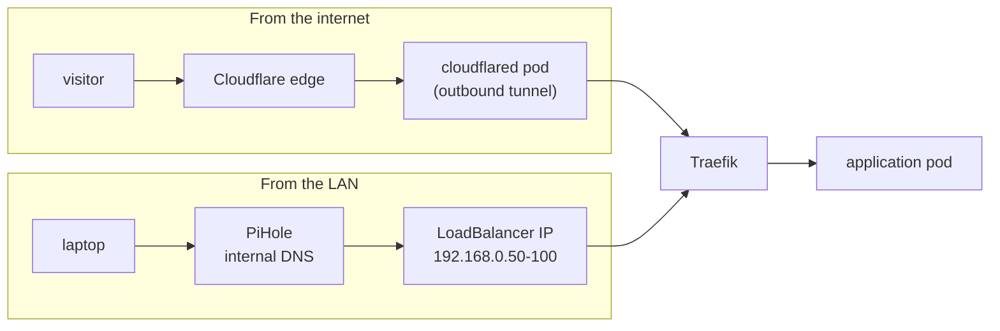

# Networking

Two ways in, one way out, and no port forward anywhere. This page traces both request
paths end to end and explains the pieces they pass through.

## The two paths



**Externally**, `zmuda.pro` resolves to a Cloudflare-proxied CNAME pointing at
`<tunnel-id>.cfargotunnel.com`. Cloudflare terminates the visitor's TLS and hands the
request to a `cloudflared` pod over a connection that pod opened outbound. Nothing listens
on the router; there is no NAT rule to get wrong.

**Internally**, hostnames like `argocd.zmuda.pro` resolve — via PiHole on the NAS — to an
address from the Cilium load-balancer pool, announced on the LAN by ARP. Internal services
are unreachable from the internet not because a rule blocks them, but because no path
exists.

Both paths terminate at the same Traefik service, so an application is configured once and
its exposure is decided entirely by which DNS record points at it.

## Cilium

Cilium is the CNI, and it replaces kube-proxy outright. Talos ships with
`cluster.network.cni.name: none` and `cluster.proxy.disabled: true`, so there is no CNI or
proxy to remove first — the cluster simply has no networking until ArgoCD installs it.

```yaml
kubeProxyReplacement: true
k8sServiceHost: localhost
k8sServicePort: 7445
```

`localhost:7445` is [KubePrism](https://docs.siderolabs.com/talos/latest/kubernetes-guides/configuration/kubeprism),
Talos's node-local API server proxy. Pointing Cilium at it removes the bootstrap paradox:
the agent needs the API server, and reaching the API server through a Service needs the
agent. It also survives a control-plane restart without the agents noticing.

The `cgroup` and `securityContext.capabilities` blocks in
[values.yaml](../kubernetes/helm/cilium/values.yaml) exist because Talos mounts cgroups
itself and grants no capability the workload has not asked for. They are copied from
Cilium's Talos guidance rather than invented.

### Load balancing without a load balancer

There is no cloud provider here, so `type: LoadBalancer` needs an answer. Cilium provides
one in two objects:

```yaml
# CiliumLoadBalancerIPPool
blocks:
  - start: "192.168.0.50"
    stop: "192.168.0.100"
```

```yaml
# CiliumL2AnnouncementPolicy
externalIPs: true
loadBalancerIPs: true
```

A Service gets an address from the pool, and a node answers ARP for it. Traefik opts in
with `loadBalancerClass: io.cilium/l2-announcer`, which keeps the mechanism explicit rather
than implicit in whatever happens to be installed.

Failover is a lease. The values shorten it deliberately:

```yaml
l2announcements:
  leaseDuration: 3s
  leaseRenewDeadline: 1s
  leaseRetryPeriod: 200ms
```

The defaults are measured in tens of seconds, which is a long outage for a node reboot on a
three-node cluster where reboots are routine. The cost is more API server chatter, which
this cluster has capacity for.

### Observability

Hubble relay and UI are enabled and published at `hubble.zmuda.pro` (internal only). Being
able to *see* flows is what makes the network policies below maintainable — a denied flow
shows up as a drop with both identities named, instead of an application that hangs for
reasons nobody can reconstruct.

## Traefik

Traefik is the only ingress controller, deployed from the upstream OCI chart with
[local values](../kubernetes/helm/traefik/values.yaml).

It is treated as infrastructure rather than as a workload:

| Setting | Effect |
| --- | --- |
| `replicas: 2` + `topologySpreadConstraints` with `DoNotSchedule` | The two replicas cannot land on the same node, so a node reboot never takes ingress with it |
| `podDisruptionBudget: minAvailable: 1` | Voluntary eviction cannot drain both |
| `priorityClassName: system-cluster-critical` | Under memory pressure, something else is evicted first |
| `minReadySeconds: 10` | A rollout that crash-loops slowly is still caught before both replicas are gone |

### Getting the real client IP back

A request that arrives through Cloudflare has Cloudflare's address as its source. Two
mechanisms restore the original, and both are needed:

- `forwardedHeaders.trustedIPs` and `proxyProtocol.trustedIPs` list every Cloudflare
  address range, so `X-Forwarded-For` from those sources is believed and from anywhere else
  is not.
- The [`cloudflare` plugin middleware](../kubernetes/kustomizations/traefik/cloudflare-middleware.yaml)
  rewrites the request header from `CF-Connecting-IP`, trusting only `10.0.0.0/8` — the
  pod network, which is where `cloudflared` sits.

Ingresses that are exposed externally opt into the middleware by annotation. Trusting a
forwarded header unconditionally is how access logs, rate limits and IP-based rules all
become fiction at once, so the trust boundary is written down in both places.

HTTP is redirected to HTTPS permanently at the entry point, and access logs are JSON with
`User-Agent` retained.

## Cloudflare Tunnel

[`cloudflared`](../kubernetes/kustomizations/cloudflared/) runs two replicas, spread across
nodes, at `high-priority`, with a single ingress rule:

```yaml
ingress:
  - service: https://traefik.traefik.svc.cluster.local:443
```

The tunnel is a dumb pipe. It does not know about applications, and adding a public
hostname is a DNS change plus an ingress label — never a tunnel config change. Its liveness
probe hits `/ready` on the metrics port, so a tunnel that is running but not connected is
restarted rather than left to look healthy.

Credentials come from a git-crypt encrypted secret, and the image tag is pinned by
kustomize and moved by [Image Updater](gitops.md#image-updates-that-leave-a-trail).

## DNS: one cluster, two providers

Both DNS zones are managed by external-dns, from the same `Ingress` and `Service` objects.
The same chart is installed twice, and a label decides which release owns a record:

| Release | Provider | Selector | Policy |
| --- | --- | --- | --- |
| pihole | PiHole on the NAS | `dns-type in (internal)` | `upsert-only`, `registry: noop` |
| cloudflare | Cloudflare | `dns-type in (external)` | default |

```yaml
# both releases
domainFilters:
  - zmuda.pro
sources:
  - service
  - ingress
```

Split-horizon DNS usually means maintaining two zone files that disagree. Here it means one
label on one manifest, and the record appears in the right place. The blog demonstrates the
whole mechanism in two overlays of the same base: prod is `dns-type: external` with a
Cloudflare-proxied CNAME to the tunnel; dev is `dns-type: internal` and exists only on the
LAN.

PiHole gets `registry: noop` and `upsert-only` because it has no TXT registry to track
record ownership, so external-dns must not be allowed to conclude that a record it cannot
account for should be deleted.

## Certificates

cert-manager issues from Let's Encrypt using a **DNS-01** solver with a Cloudflare API
token, and both a staging and a production
[ClusterIssuer](../kubernetes/kustomizations/cert-manager/cluster-issuer.yaml) exist.

DNS-01 is the only option that works here, and it is also the better one: HTTP-01 requires
the validation server to reach the host, which is impossible for a name that resolves only
on the LAN. With DNS-01, internal-only services still get publicly trusted certificates —
`argocd.zmuda.pro`, `hubble.zmuda.pro` and the rest are real HTTPS, not a click-through
warning or a private CA that every device has to be taught about.

Applications request a certificate with a single annotation:

```yaml
annotations:
  cert-manager.io/cluster-issuer: lets-encrypt-prod
```

## Network policy

Every exposed application namespace carries a `CiliumNetworkPolicy`, and the default shape
is: ingress from the Traefik namespace only, egress nothing.

```yaml
# blog
ingress:
  - fromEndpoints:
      - matchLabels:
          k8s:io.kubernetes.pod.namespace: traefik
egress: []
```

A static site has no reason to originate a connection, so it cannot. Where egress is
genuinely needed it is enumerated, at the narrowest form Cilium supports —
[Vaultwarden](../kubernetes/kustomizations/vaultwarden/netpol.yaml) may reach kube-dns, one
SMTP host by FQDN, and one IP and port for backups. Nothing else, including the rest of the
LAN.

That is the payoff of an identity-aware CNI: the policy names `smtp.protonmail.ch` and the
`traefik` namespace, not a CIDR that stops meaning what it meant when the pod moved.

## See also

- [Architecture](architecture.md) — where these components sit in the boot order
- [Security](security.md) — what watches the traffic these policies allow
- [Operations](operations.md) — exposing a new application on either path
