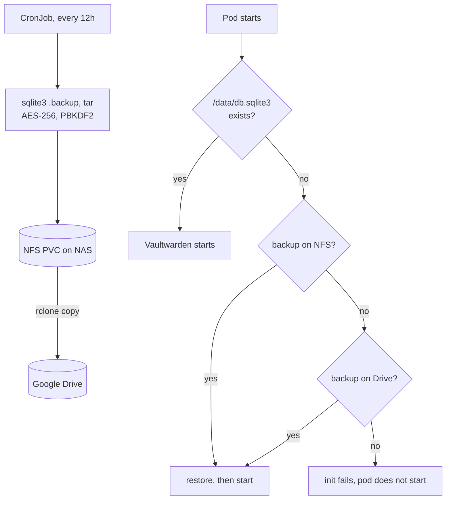

# Storage and backups

Nodes hold nothing worth keeping. Every byte that matters is on the Synology DS923+ or in
this repository, which is what makes a node a disposable PXE boot rather than a machine
anyone is careful with.

## Storage classes

The [Synology CSI driver](../kubernetes/kustomizations/synology-csi/) provisions both iSCSI
LUNs and NFS shares from the NAS. Nine storage classes exist, and their names are a grammar
rather than a list to memorise:

```text
synology-<protocol>-<reclaim>[-<tier>][-<purpose>]
```

| Axis | Values | Chosen by |
| --- | --- | --- |
| protocol | `iscsi`, `nfs` | Block for single-writer databases and config, NFS for anything `ReadWriteMany` |
| reclaim | `retain`, `delete` | Whether losing the PVC should be survivable |
| tier | *(none)* = HDD, `ssd` = `/volume2` | Latency vs. capacity |

`synology-nfs-delete` is the cluster default: the safe thing to get by accident is a volume
that goes away with its claim, not one that quietly accumulates on the NAS forever.

Two parameter choices are worth stealing:

- **iSCSI volumes are btrfs, formatted `--nodiscard`.** Discard during format on a
  thin-provisioned LUN issues a very large number of UNMAPs to the NAS for no benefit,
  because the LUN is empty by definition.
- **The PostgreSQL class is its own thing** — `synology-nfs-retain-ssd-postgres`, mounted
  `hard` with `0750` permissions. A soft NFS mount returns I/O errors on interruption, and a
  database that receives an I/O error instead of a pause is a database that corrupts. This
  is the one workload where the mount option is not a detail.

All classes allow volume expansion, so growing a volume is an edit to a PVC.

## Snapshots

The [external-snapshotter](https://github.com/kubernetes-csi/external-snapshotter) CRDs are
pulled straight into the kustomization from a pinned upstream tag, and a default
`VolumeSnapshotClass` points at the Synology driver. That makes CSI snapshots available to
anything that asks — most importantly Velero.

## Velero

[Velero](../kubernetes/helm/velero/values.yaml) runs two schedules with different jobs.

| Schedule | Cadence | Retention | Scope |
| --- | --- | --- | --- |
| `cluster-full` | daily | 30 days | Every Kubernetes object |
| `csi-opt-in-pvc-snapshots` | every 12 hours | 7 days | Only PVCs labelled `backup.velero.io/csi-snapshot: "true"` |

The split is the point. Cluster objects are cheap to store and the whole set is worth
keeping; volume snapshots are neither, and a 7 TiB media library does not belong in a
backup rotation when it is reconstructible and its contents are already on the NAS.

So volume backup is **opt-in by label**, and each PVC that carries the label carries it for
a reason:

```yaml
labels:
  backup.velero.io/csi-snapshot: "true"
```

Backups land in a [Garage](https://garagehq.deuxfleurs.fr/) S3 bucket on the NAS. The
location is deliberately **not** marked default — a backup should be sent somewhere on
purpose, not by omission.

Object-level backups matter less here than they would elsewhere, because the manifests are
all in git. Velero's real value in this cluster is the volume data and the objects nobody
declared: generated secrets, CRD state, whatever ArgoCD would recreate but not repopulate.

## Application-level backup: Vaultwarden

A password manager gets a third layer, because "restore the cluster" is not an acceptable
answer for the thing that holds every credential. The
[backup and restore images](../apps/vaultwarden/) built in this repository do it:



Three properties are doing the work:

- **The restore is an init container, not a runbook.** An empty data volume is repaired
  before Vaultwarden ever opens it.
- **Failing to restore fails the pod.** Starting empty would present a working, empty vault
  and let the first sync overwrite the clients' copies. Refusing to start is the safe
  failure, and it is chosen explicitly.
- **The remote copy is genuinely off-site.** Encrypted before it leaves the cluster, with a
  key the remote never sees.

Both images run as UID 1000, non-root, read-only root filesystem, all capabilities dropped,
and they are built from [Docker Hardened Images](supply-chain.md#base-images) and signed
like everything else published here.

## Protecting data from GitOps itself

Automated `prune` is what makes GitOps trustworthy, and also what makes it dangerous near
storage. Deleting a manifest deletes the object, and for a PVC that can mean deleting the
volume.

Data claims opt out explicitly:

```yaml
annotations:
  argocd.argoproj.io/sync-options: Delete=false,Prune=false
```

The media namespace, its 7 TiB downloads claim and both Vaultwarden PVCs carry it. Combined
with `reclaimPolicy: Retain` on the storage class, removing an application from git tears
down its workloads and leaves its data on the NAS.

## What is actually recoverable

Being honest about this is more useful than a claim of full coverage:

| Loss | Recovery | Time to restore |
| --- | --- | --- |
| A node | PXE boot a replacement, it rejoins | Minutes, no data involved |
| The whole cluster | [Bootstrap from this repository](operations.md#bootstrapping-from-nothing) | Everything declarative returns unattended |
| A PVC | Velero CSI snapshot, if it was labelled | Up to 12 hours of data |
| Vaultwarden data | Local backup, then Google Drive, automatically | Up to 12 hours, and the only path that survives losing the NAS |
| The NAS | Vaultwarden restores from Drive. Everything else was on it. | Media is re-acquirable; other volumes are not |

That last row is the standing gap, and it is a deliberate one: Velero's bucket lives on the
same NAS as the volumes it backs up, so it protects against deletion and corruption but not
against hardware loss. Fixing it means an off-site S3 target, which is a cost decision
rather than a technical one.

The git-crypt key is the other single point of failure. It lives outside the cluster and
outside this repository, and without it a rebuilt ArgoCD can read none of the secrets it
would need. See [Operations](operations.md#bootstrapping-from-nothing).

## See also

- [Synology notes](synology.md) — what is configured on the NAS itself, by hand
- [Architecture](architecture.md#where-the-state-lives) — how storage fits the whole
- [Operations](operations.md) — restore procedures and bootstrap
