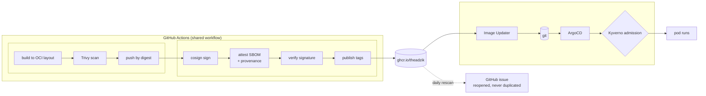

# Supply chain

Four container images are built for this cluster, and every one of them is scanned before
it is pushed, signed at its digest, described by an SBOM, and checked again by the cluster
at admission. This page covers the homelab half of that chain. The workflow that implements
the build half lives in [theadzik/github-workflows](https://github.com/theadzik/github-workflows),
where three repositories can share one implementation.



## What is built here

| Image | Source | Tagging |
| --- | --- | --- |
| `vw-backup` | [apps/vaultwarden/backup](../apps/vaultwarden/backup/) | Git tag `vw-backup-<CalVer>` |
| `vw-restore` | [apps/vaultwarden/restore](../apps/vaultwarden/restore/) | Git tag `vw-restore-<CalVer>` |
| `custom-argocd` | [apps/custom-argocd](../apps/custom-argocd/) | The ArgoCD app version it patches |
| `zmuda-pro-blog` | [theadzik/blog](https://github.com/theadzik/blog) | CalVer for releases, `sha-<commit>` for `main` |

`custom-argocd` works out its own tag. The
[workflow](../.github/workflows/custom-argocd.yaml) reads the chart version out of the
[ArgoCD Application](../kubernetes/bootstrap/charts/app-of-apps/templates/argocd.yaml),
resolves that chart's `appVersion` with `helm search`, and builds `FROM
quay.io/argoproj/argocd:<that version>`. The patched image therefore cannot drift from the
version the cluster is actually running. Changing the chart version in git is the only way
to move it.

Its [build stage](../apps/custom-argocd/Dockerfile) downloads `git-crypt` pinned to a
version and asserts the download against a pinned SHA256, failing the build on a mismatch
instead of installing whatever arrived. It is the same pattern the Ansible `git` role uses
for the same binary on a workstation; see [Conventions](conventions.md#ansible).

The two Vaultwarden images also rebuild weekly on a schedule. Base images gain fixes
between releases, and an image that is only rebuilt when its source changes gets steadily
older than its own base.

## Order matters at both ends

The shared workflow builds to an **OCI layout on disk**, scans it there, and only then
pushes. Nothing unscanned ever reaches the registry. The digest that was scanned is also the
one that gets signed, pushed and deployed, not a rebuild that happens to have the same
inputs.

At the far end, **tags are published last**, after the signature and both attestations
exist. That ordering is specific to how this cluster works. ArgoCD Image Updater discovers
images by listing tags, so a tag that appeared before the signature would advertise an image
the cluster is about to refuse.

Signing is keyless, and the identity in the certificate is the *called* workflow. That is why
the Kyverno policy below names `github-workflows` and not this repository.

## Base images

Every stage of the Vaultwarden images builds `FROM dhi.io/*`, the [Docker Hardened
Images](https://www.docker.com/products/hardened-images/), which are minimal and non-root by
default. The final stage copies binaries from a `-dev` stage that has a package manager, and
keeps nothing that installed them.

That produces a known blind spot, [written down in the
Dockerfile](../apps/vaultwarden/backup/Dockerfile) so nobody has to rediscover it. Binaries
that arrive by `COPY` leave no package-manager record, and `syft` has no classifier for
`sqlite3` or `tar`. Neither appears in the SBOM or in a scan, so a CVE in either would be
invisible to every gate here.

The obvious fixes do not work. The non-dev base ships no `apk`, so nothing can be installed
in the final stage. Copying the build stage's package database would then claim the whole
dev toolchain is present. And `BUILDKIT_SBOM_SCAN_STAGE` stopped applying once syft took
over SBOM generation from BuildKit. The gap therefore stands, with a note in the Dockerfile:
*if you add another copied binary, add it here.*

## Admission: the cluster checks the work

[`validate-image-attestations.yaml`](../kubernetes/kustomizations/kyverno/validate-image-attestations.yaml)
is a Kyverno `ImageValidatingPolicy` that verifies, for every `ghcr.io/theadzik/*` image:

1. A cosign signature from the expected keyless identity.
2. A signed CycloneDX SBOM attestation.
3. A signed SLSA provenance attestation.

The identity is one regular expression, and every dot in it is escaped:

```text
^https://github\.com/theadzik/github-workflows/\.github/workflows/build-and-push\.yaml@.+$
```

An unescaped `.` matches any character, which would let a lookalike host satisfy the
pattern. Only the ref after `@` is open, because each caller pins a different commit of the
shared workflow.

Two details in the policy only surfaced once it was running against real pods:

- **`matchConditions` restricts the webhook to pods that reference one of our images.**
  Without it the webhook is consulted for every pod in the cluster and passes each one
  without checking anything, because a CEL `.all()` over an empty list is `true`. The policy
  was reporting success for pods it had never looked at.
- **The SBOM check accepts CycloneDX *or* SPDX**, with a comment naming the exact images
  that still carry the old format and the condition for deleting the fallback. CEL `||`
  short-circuits, so current images pay for one attestation fetch and only the older ones
  pay for two.

### Currently Audit, not Deny

`validationActions: [Audit]` and `failurePolicy: Ignore`. The policy reports violations. It
does not block them.

This is a staging post, not an oversight. Verification means fetching
attestations and querying Rekor for every container in a matched pod, and the cost sits
close enough to the webhook timeout that flipping to `Deny` today would trade a supply-chain
risk for an availability risk. A slow transparency log would start blocking unrelated
deployments. Getting to `Deny` means making verification cheaper per admission. Until then a
background scan re-verifies every matched pod every six hours, so drift stays visible even
while it is not blocked.

## Detection after the build

A build gate fires once, on the day the image is built. It cannot see a CVE published the
day after. More usefully, it cannot see the day an upstream release finally makes a known
finding fixable.

[`scan-published-images.yaml`](../.github/workflows/scan-published-images.yaml) closes that
gap. Daily, it resolves the current tag of each published image, pins it to a digest, and
scans it with **both Trivy and Grype**.

The second scanner earns its place. Measured on one of these images against the same SBOM,
Trivy reported 4 findings and Grype 9. The extra five were all Go advisories, which is
exactly where these images carry their risk. The two databases disagree often enough that
taking the union is cheaper than picking a winner.

How it reports:

- **It reports, it never gates.** Every finding it can currently see is already known and
  accepted. Failing the run every day would just train everyone to ignore it.
- **It fails only when a scanner could not run.** A swallowed scanner error reports zero
  findings, and that looks exactly like a clean image. Not being able to tell those apart is
  the failure this workflow exists to prevent.
- **One issue, reopened and rewritten.** A daily scan that files a daily issue is a daily
  notification nobody reads. When the findings clear, it comments and closes.

Three images have the *build* gate switched off (`scan: false`), each with the reason in the
workflow. Every finding sits inside a binary copied from an upstream image, in rclone's own
Go dependencies or ArgoCD's, and nothing in this repository can rebuild those. Left on, the
gate would block the weekly rebuild forever and never once produce a finding anyone could
act on. The daily scan covers those images instead, and is where an upstream fix shows up
first.

## Why GHCR

Everything publishes to `ghcr.io/theadzik/*`, public. Docker Hub had to go. Image Updater
reconciles roughly twenty images every few minutes and Kyverno re-verifies on top of that,
which consumed the anonymous pull quota as fast as it refilled. Signing started failing and
policy evaluation returned `429`. GHCR applies no pull rate limit to public images, so the
ceiling disappears instead of being raised.

Docker Hub is still used for *pulling* third-party images, so a pull secret survives where
something still needs it.

## Dependencies

[Dependabot](../.github/dependabot.yml) covers every ecosystem in the repository: pip,
Docker, GitHub Actions and pre-commit. The reasoning is the same throughout.

| Choice | Reason |
| --- | --- |
| `cooldown: default-days: 7` | A compromised release is usually yanked within days. Waiting a week costs nothing and skips that window. |
| `semver-major-days: 14` | Majors carry the largest diff and get the least useful review. Upstream's follow-up patch usually lands inside two weeks. |
| `insecure-external-code-execution: deny` on pip | Resolving a Python manifest can execute code from the package being resolved. Nothing here needs that, and denying it keeps a compromised release away from Dependabot's registry credentials. |
| `replaces-base: true` on the Docker Hub registry | Images with no registry host, like `ubuntu` or `rclone/rclone`, default to an anonymous Docker Hub lookup. `replaces-base` routes that default through the credentialed `docker-hub` registry entry instead, so those pulls share my account's rate limit rather than sharing the anonymous one with every other caller on the runners. |
| `pre-commit` ecosystem | Hook revisions are pinned in `.pre-commit-config.yaml` and are the only copy of those versions. Hadolint and shellcheck stop gaining rules the moment those pins go stale. |

Third-party GitHub Actions are pinned by commit SHA with the version in a trailing comment,
including the shared workflow itself. Dependabot updates the SHA and the comment together.

## See also

- [github-workflows](https://github.com/theadzik/github-workflows): the shared build
  workflow, its inputs and the reasoning behind each tool choice
- [Security](security.md): what happens after admission
- [GitOps](gitops.md#image-updates-that-leave-a-trail): how a new tag becomes a running pod
